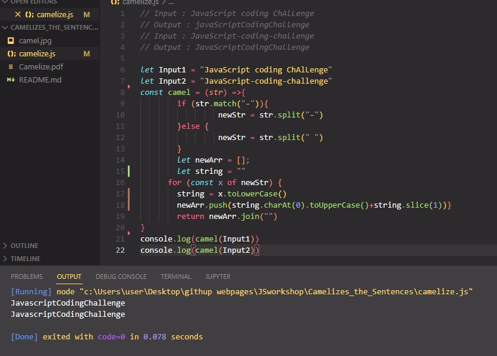

## Camelizes the Sentences.

The purpose of this coding challenge is to create a function that will take text in kebab case format or with
spaces and output it in camel case format.
Expected Outcome
For Example:
Input : JavaScript coding ChAlLenge
Output : javaScriptCodingChallenge
Input : JavaScript-coding-challenge
Output : JavaScriptCodingChallenge
Input : javaScriptCodingChallenge
Output : javaScriptCodingChallenge

# Learning Outcomes

Aim of this challenge is as follows;

 -analyze a problem, identify and apply programming knowledge for appropriate solution.
 -demonstrate their knowledge of algorithmic design principles by using JavaScript effectively.
# Problem Statement
Call your function with a string. The input string must not contain both '-' and ' '. only '-' or ' '
Format the input string as camel case

 ⌛ Happy Coding  ✍ 

## 🖥️Screen version
 

