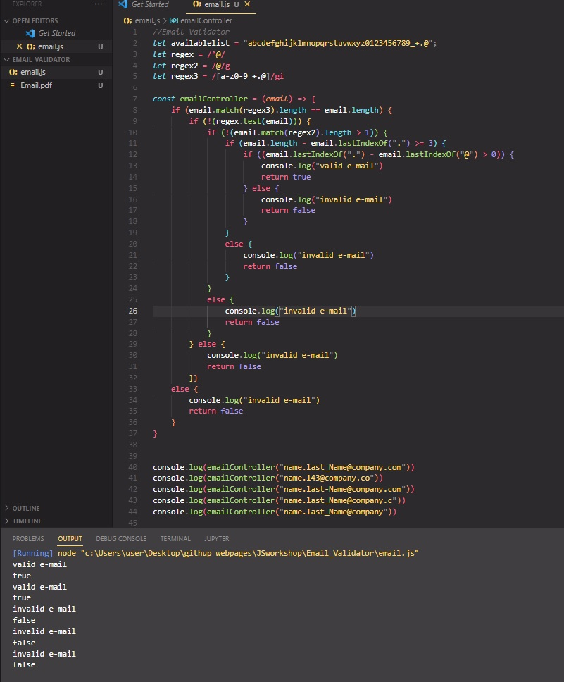

## Email Validator

The purpose of this coding challenge is to create a function that will check the given email address valid or
not.
 
Expected Outcome
 
For Example:
 
Input : JavaScript coding ChAlLenge 
Output : javaScriptCodingChallenge 
Input : JavaScript-coding-challenge 
Output : JavaScriptCodingChallenge 

# Learning Outcomes

Aim of this challenge is as follows;

 -analyze a problem, identify and apply programming knowledge for appropriate solution. 
 -demonstrate their knowledge of algorithmic design principles by using JavaScript effectively. 
# Problem Statement
- Write a function that takes email variable and return true or false and write console invalid or valid.  
- Valid characters in the email address will be 'abcdefghijklmnopqrstuvwxyz0123456789_+.@' P.S. : 
- Capital letters are allowed. 
- An email should not start with '@' symbol and should not contain more than one '@' sign. 
- There should be at least two characters after the '.' sign. (like .co or .com) 
- There should be at least one '. after the '@' sign. 

 ⌛ Happy Coding  ✍ 

## 🖥️Screen version
 

