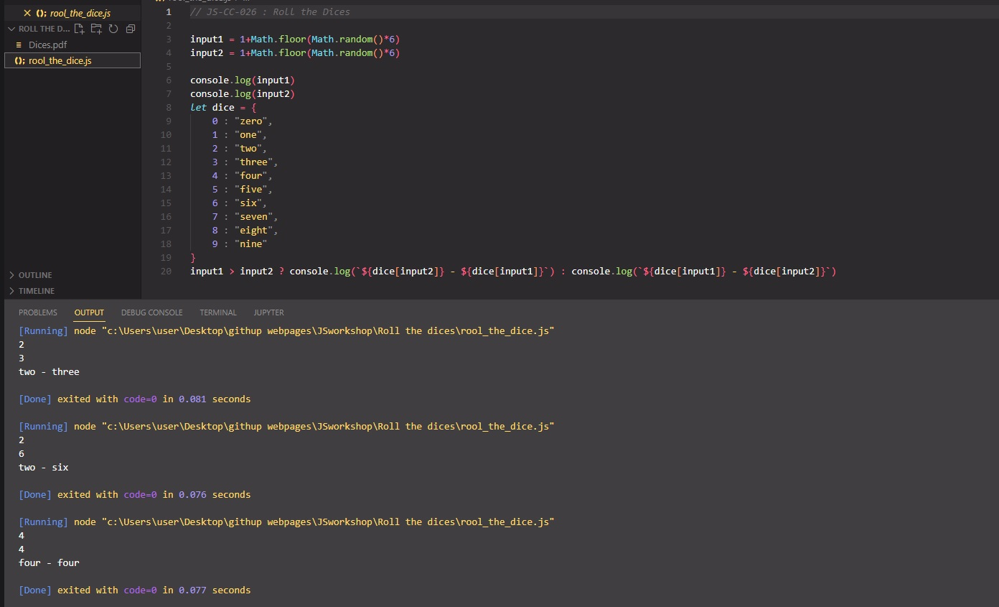

## Roll the Dices

The purpose of this coding challenge is to create two dice, shake them the desired number of times, and write
a function that prints the results as text.
# Learning Outcomes

Aim of this challenge is as follows;

 -analyze a problem, identify and apply programming knowledge for appropriate solution. 
 -demonstrate their knowledge of algorithmic design principles by using JavaScript effectively. 
 
 
# Expected Outcome
 
- if first dice is 1 and second dice is 6, output should be 'one - six' 
  For example : 
- call this function with dices(10) Yo should display all 10 result. 
- And display the result in the following format on the console: 
- for Example: 
- 1st dice: 2 2nd dice: 3 output => 'two' - 'three' 
- 1st dice: 6 2nd dice: 4 output => 'four' - 'six' // Always dsiplay the low dice first. 

 ⌛ Happy Coding  ✍ 

## 🖥️Screen version
 

