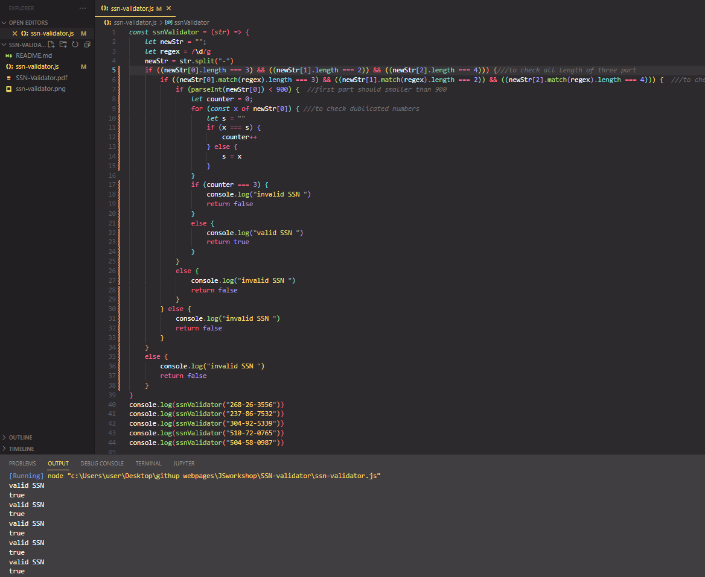

## SSN (Social Security Number) Validator

The purpose of this coding challenge is to create a function that will check the given SSN (Social Security
Number) is valid or not valid.
# Learning Outcomes

Aim of this challenge is as follows;

 -analyze a problem, identify and apply programming knowledge for appropriate solution. 
 -demonstrate their knowledge of algorithmic design principles by using JavaScript effectively. 
 
# Problem Statement
- Valid a SSN (Social Security Number); 
- should have 9 digits. 522-82-5151 
- should be divided into 3 parts by hyphen (-). 
- The first part should have 3 digits and should not be 000, 666, or between 900 and 999. 
- The second part should have 2 digits and it should be from 01 to 99. 
- The third part should have 4 digits and it should be from 0001 to 9999. 

 
Expected Outcome
 
Random Valid SSN numbers for check your code

268-26-3556 
237-86-7532 
304-92-5339 
510-72-0765 
504-58-0987 

 ⌛ Happy Coding  ✍ 

## 🖥️Screen version
 

