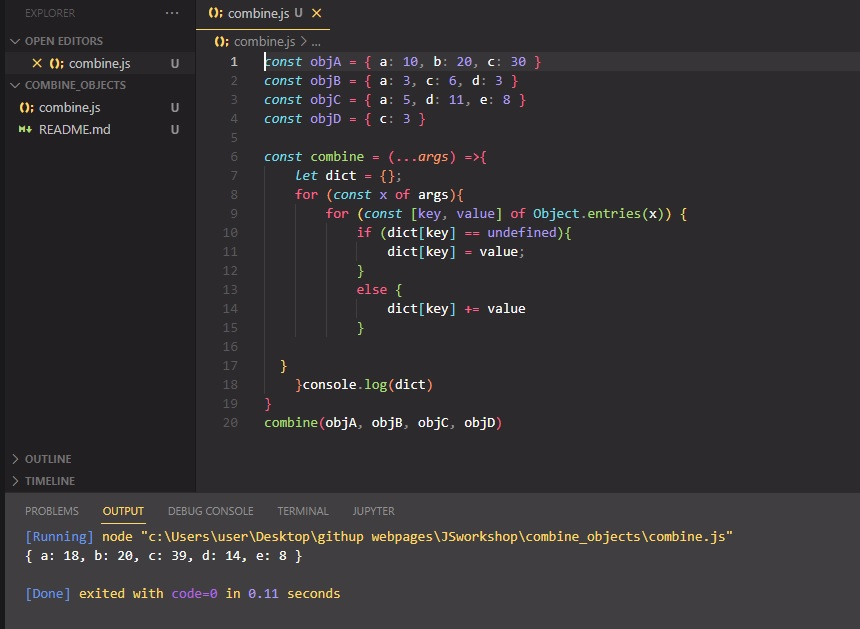

# Combine Object

In this case you get the start number and the end number of a region and should return the count of all numbers except numbers with a 5 in it. The start and the end number are both inclusive!

# Learning Outcomes

Aim of this challenge is as follows;

 -analyze a problem, identify and apply programming knowledge for appropriate solution. 
 -demonstrate their knowledge of algorithmic design principles by using JavaScript effectively. 
 
# Problem Statement
Examples: 
1,9 -> 1,2,3,4,6,7,8,9 -> Result 8 
4,17 -> 4,6,7,8,9,10,11,12,13,14,16,17 -> Result 12 
The result may contain fives. ;-) 
The start number will always be smaller than the end number. Both numbers can be also negative! 

 ⌛ Happy Coding  ✍ 

## 🖥️Screen version
 

