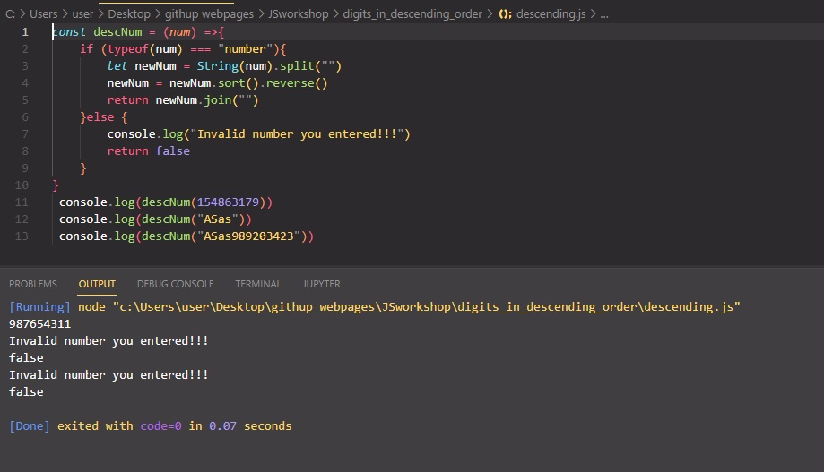

# Digits in descending order

Your task is to make a function that can take any non-negative integer as an argument and return it with its digits in descending order. Essentially, rearrange the digits to create the highest possible number.

# Learning Outcomes

Aim of this challenge is as follows;

 -analyze a problem, identify and apply programming knowledge for appropriate solution. 
 -demonstrate their knowledge of algorithmic design principles by using JavaScript effectively. 
 
# Problem Statement
Examples: 
Input: 42145 Output: 54421 
Input: 145263 Output: 654321 
Input: 123456789 Output: 987654321 

 ⌛ Happy Coding  ✍ 

## 🖥️Screen version
 

