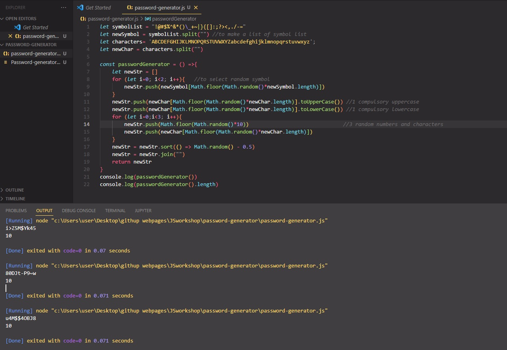

## Random Password Generator

Purpose of the this coding challenge is to write a code that can generate random password for 10 characters
as default and expected constraints below.

# Learning Outcomes

Aim of this challenge is as follows;

 -analyze a problem, identify and apply programming knowledge for appropriate solution. 
 -demonstrate their knowledge of algorithmic design principles by using JavaScript effectively. 
 
# Problem Statement
- password length must be equal to 10  
- there should be 3 numbers and there should 2 symbols from below: 

!@#$%^&*()\_+~|}{[]:;?><,./-=

- excluding single and double quotes 
- there should be minimum 1 lower and 1 upper case letters, 

 
Expected Outcome
 
valid samples:
Aa123&!xyz 
Aa@/456stu 
123aA(p?rs 
invalid samples:  
AB123&!XYZ // no lower case letters 
ab123&!xyz // no upper case letters 
Aa@c456stu // only one symbol 
12aA(p?rsz // only two numbers 

 ⌛ Happy Coding  ✍ 

## 🖥️Screen version
 

