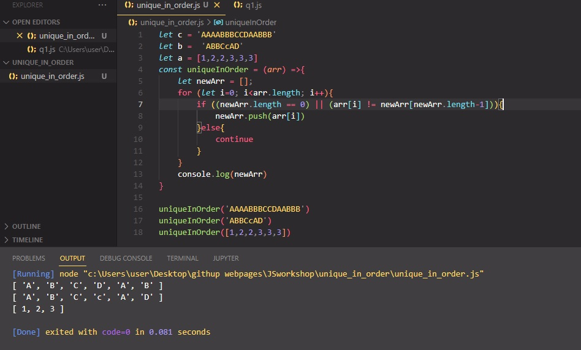

# Unique in order

Implement the function unique_in_order which takes as argument a sequence and returns a list of items without any elements with the same value next to each other and preserving the original order of elements.

# Learning Outcomes

Aim of this challenge is as follows;

 -analyze a problem, identify and apply programming knowledge for appropriate solution. 
 -demonstrate their knowledge of algorithmic design principles by using JavaScript effectively. 
 
# Problem Statement
For example: 
uniqueInOrder('AAAABBBCCDAABBB') == ['A', 'B', 'C', 'D', 'A', 'B'] 
uniqueInOrder('ABBCcAD')         == ['A', 'B', 'C', 'c', 'A', 'D'] 
uniqueInOrder([1,2,2,3,3,3])       == [1,2,3] 

 ⌛ Happy Coding  ✍ 

## 🖥️Screen version
 

